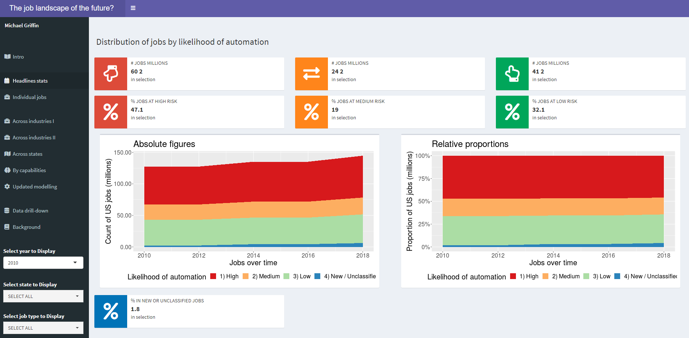

# How vulnerable are US jobs to automation in the medium-term?

“47% could be done by machines “over the next decade or two””
Carl Benedikt Frey and Michael Osborne of Oxford University

See blog post here: https://nycdatascience.com/blog/student-works/how-vulnerable-could-us-jobs-be-to-automation/

See Shiny IO here: https://mfgriffin.shinyapps.io/Shiny/

## Project aims:

1) Produce a dynamic tool for visualisation research on the possible impact of automation/computerisation of jobs over the medium-term
2) Update the original 2012 research to latest available information accounting for job number changes, skill movemenets and remodelling

The dashboard enables users to explore a variety of questions which could be of use to individuals, organisations and policy-makers:

1) Individuals: is my current or future role likley to be replaced? Are there particular skills to emphasise on to help future-proof careers?
2) Policy-makers: how many jobs are at risk of computerisation?  How are high risk roles distributed across states and industries?
3) Businesses: what are the threats and opportunities which arise with the possible changes in job landsdcape? Could retraining employees to adjacent roles make sense?
4) General - has the forecast or analysis changed since the original 2012 research?

